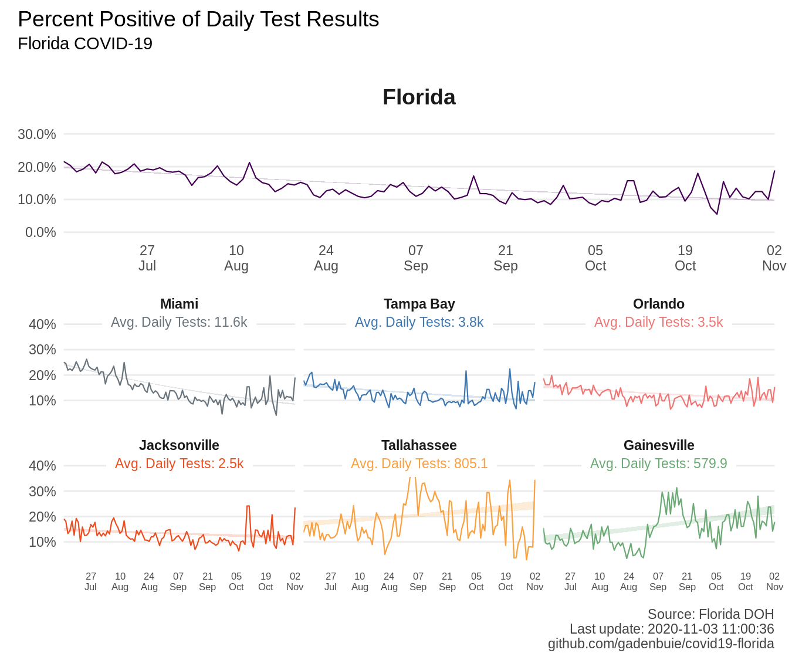

Florida COVID-19 Data
================
2020-07-25 12:05:21

## Today

| When        | Day        | Positive | New Positive Since | Deaths | New Deaths Since | Total     |
| :---------- | :--------- | :------- | :----------------- | :----- | :--------------- | :-------- |
| Today       | 2020-07-25 | 414,511  | 0                  | 5,894  | 0                | 3,336,377 |
| Yesterday   | 2020-07-24 | 402,312  | 12,199             | 5,768  | 126              | 3,276,636 |
| Last Week   | 2020-07-18 | 337,569  | 76,942             | 5,002  | 892              | 2,931,988 |
| 2 Weeks Ago | 2020-07-11 | 254,511  | 160,000            | 4,301  | 1,593            | 2,475,299 |

Parsed from the [Florida’s COVID-19 Data and Surveillance
Dashboard](https://fdoh.maps.arcgis.com/apps/opsdashboard/index.html#/8d0de33f260d444c852a615dc7837c86).

Prior to 2020-04-25, Florida DOH published updated data twice per day.
Starting 2020-04-25, Florida DOH updates once per day at approximately
11am. Since 2020-05-06, the updates are occasionally later in the day.
In the following charts, for a given day, I use the last value reported
prior to 8am of the subsequent day. I take snapshots of the various FL
DOH data sources at 7am, noon and 7pm daily.

## Confirmed Cases

## Hospital and ICU Utilization

| County       | Current COVID Hospitalizations | Change Since Yesterday                     | Available Hospital Beds                      | Available ICU Beds                         |
| :----------- | -----------------------------: | :----------------------------------------- | :------------------------------------------- | :----------------------------------------- |
| All          |                           8971 | ↓ -229 | 14131/45905 | 1033/5147 |
| Miami-Dade   |                           1874 | ↓ -106 | 1650/6940   | 93/907    |
| Broward      |                           1295 | ↑ 12   | 1008/4301   | 34/492    |
| Palm Beach   |                            595 | ↑ 22   | 1186/2974   | 111/313   |
| Orange       |                            556 | ↓ -40  | 1097/3327   | 90/282    |
| Hillsborough |                            541 | ↓ -28  | 642/3123    | 57/331    |
| Duval        |                            478 | ↓ -16  | 1055/2945   | 110/331   |
| Pinellas     |                            401 | ↓ -15  | 528/2312    | 37/252    |
| Polk         |                            273 | ↓ -3   | 424/1263    | 25/145    |
| Lee          |                            215 | ↓ -18  | 309/1461    | 13/128    |
| Osceola      |                            208 | ↓ -3   | 274/894     | 33/96     |

## Daily Testing

<!--  -->

## Cases and Deaths by Age

## Sources

  - [Florida’s COVID-19 Data and Surveillance
    Dashboard](https://fdoh.maps.arcgis.com/apps/opsdashboard/index.html#/8d0de33f260d444c852a615dc7837c86)

  - [Florida Department of Health COVID-19 status
    page](http://www.floridahealth.gov/diseases-and-conditions/COVID-19/)

  - PDF Reports released daily on [Florida Disaster
    Covid-19](http://www.floridahealth.gov/diseases-and-conditions/COVID-19/)

The data structure and format of the released data changes frequently.
I’m keeping track of the impact of these changes in this repo in
[NEWS.md](NEWS.md).

## FL DOH Dashboard

One table is extracted from the [Florida’s COVID-19 Data and
Surveillance
Dashboard](https://fdoh.maps.arcgis.com/apps/opsdashboard/index.html#/8d0de33f260d444c852a615dc7837c86).

  - Current test counts:
    [data/covid-19-florida\_dash\_summary.csv](data/covid-19-florida_dash_summary.csv)

The `timestamp` column of indicates when the dashboard was polled for
changes.

Testing statistics prior to 2020-03-16 18:00:00 EDT were imported from
<https://covidtracking.com>.

## Snapshots and Data Capture

Initially this repo gathered data from the [Florida Department of Health
COVID-19 status
page](http://www.floridahealth.gov/diseases-and-conditions/COVID-19/).
This page has been [reformatted several
times](screenshots/floridahealth_gov__diseases-and-conditions__COVID-19.png)
and the data structure changes frequently, so currently I am collecting
snapshots of the webpage and not trying to parse these tables.

I am also capturing a snapshot (HTML) and screenshot of the [Florida’s
COVID-19 Data and Surveillance
Dashboard](https://fdoh.maps.arcgis.com/apps/opsdashboard/index.html#/8d0de33f260d444c852a615dc7837c86).
Data extracted from the dashboard are currently used for the current
test count summaries, available in
[covid-19-florida-tests.csv](covid-19-florida-tests.csv).

Prior to the afternoon of 2020-03-18, the dashboard reported
county-level case counts. Around 4pm on 2020-03-18, the dashboard layout
was modified, making these counts inaccessible. Similarly, prior to this
update I was relying on the reported “last update time” listed in the
dashboard, but since then I have been using the time at which the
dashboard was checked for any time stamps from this source.

On the same day that county-level data became inaccessible in the
dashboard, FL DOH started releasing PDF reports, which I have begun to
collect in [pdfs/](pdfs/). The name of the report contains a time stamp,
therefore I am periodically checking the FL DOH web page for the updated
link. I’ve been able to extract most of the data from the PDF tables.
Individual tables are stored in time stamped folders, using the time
stamp in the PDF file name. The unified data files are available in
[data/](data/) and prefixed with `covid-19-florida_pdf_`.
